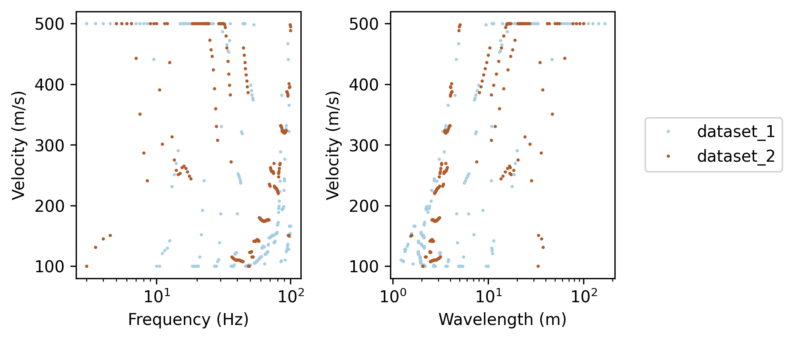
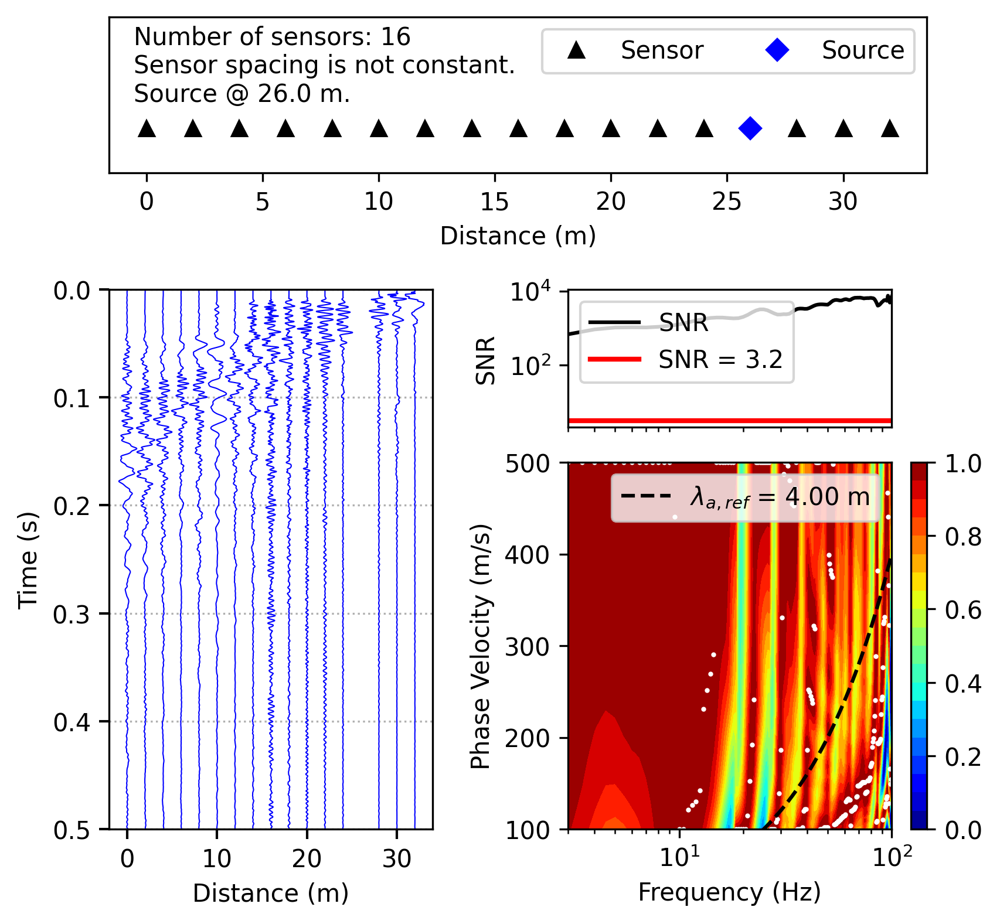
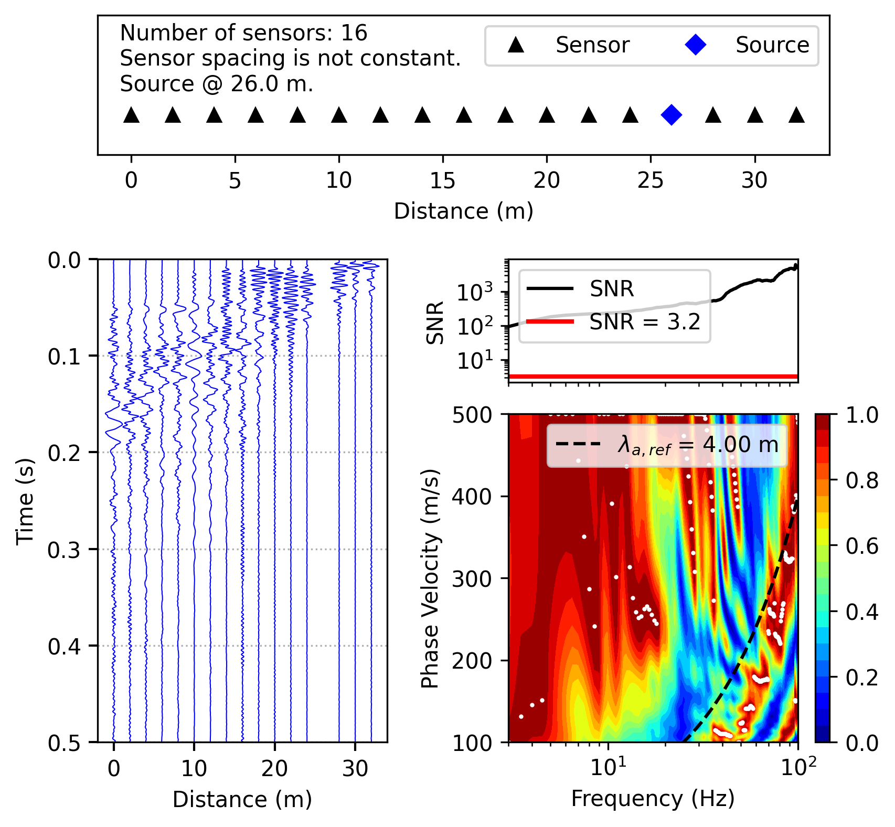

# MASW Processing and Dispersion Analysis

Python workflow for processing active-source Multichannel Analysis of Surface Waves (MASW) data and extracting Rayleigh-wave dispersion information.



## Overview

This repository provides a reproducible workflow for processing active-source MASW data using [`swprocess`](https://github.com/jpvantassel/swprocess).

The workflow includes:

* Dataset organization and validation
* Signal preprocessing
* Frequency-Domain Beamforming (FDBF)
* Signal-to-noise ratio (SNR) analysis
* Dispersion-image generation
* Automatic dispersion-curve extraction
* Acquisition and array-geometry diagnostics
* Visualization and JSON export

The processing parameters are explicitly defined in `masw_processing.py` so they can be reviewed and adapted to different MASW investigations.

## Processing Configuration

The current example uses:

| Parameter        | Configuration |
| ---------------- | ------------- |
| Workflow         | Time-domain   |
| Transformation   | FDBF          |
| Frequency range  | 3–100 Hz      |
| Velocity range   | 100–500 m/s   |
| Velocity samples | 400           |
| Weighting        | Square-root   |
| Steering         | Cylindrical   |
| SNR analysis     | Enabled       |

Acquisition geometry and recording parameters are also reported during processing to support quality control.

## Input Data

Example MASW records are provided in:

```text
data/
├── 1.dat
├── 2.dat
├── ...
└── 15.dat
```

Dataset grouping is explicitly defined by the operator in `masw_processing.py`. Proper organization and identification of acquisition data are considered part of the data-acquisition workflow.

## Outputs

The workflow generates:

```text
figures/
├── masw_dispersion_curves.png
├── masw_dispersion_dataset_1.png
└── masw_dispersion_dataset_2.png

results/
├── masw_dispersion.json
├── masw_rayleigh_masw.json
└── nz_wghs_rayleigh_masw.json
```

### Example Results





## Project Structure

```text
MASW-Uncertainty-Analysis/
│
├── data/
├── figures/
├── results/
├── masw_processing.py
├── requirements.txt
├── README.md
└── .gitignore
```

## Requirements

Python 3.11

```text
swprocess==0.3.0
numpy==1.24.2
matplotlib==3.7.1
```

Install dependencies with:

```bash
pip install -r requirements.txt
```

Run the workflow with:

```bash
python masw_processing.py
```

## Citation

This workflow uses `swprocess`, developed by Joseph P. Vantassel and collaborators.

**Software**

Vantassel, J. P. (2021). *jpvantassel/swprocess: latest (Concept).* Zenodo.
https://doi.org/10.5281/zenodo.4584128

**Publication**

Vantassel, J. P., & Cox, B. R. (2022). SWprocess: a workflow for developing robust estimates of surface wave dispersion uncertainty. *Journal of Seismology, 26*, 731–756.
https://doi.org/10.1007/s10950-021-10035-y

## License

This repository contains original workflow code and documentation for MASW data processing.

`swprocess` is an independent open-source project. Its licensing and citation requirements apply separately.
